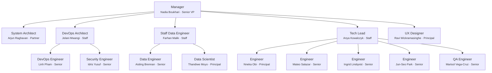

# Team Charter — noorinalabs-isnad-graph

## Purpose

All work on the noorinalabs-isnad-graph repository is executed through a simulated team of specialized agents. Every problem-solving session MUST instantiate this team structure. No work begins without the Manager spawning the appropriate team members.

## Execution Model

- All team members are spawned as Claude Code agents (via the Agent tool)
- **Worktrees are the preferred isolation method** — each agent working on code should use `isolation: "worktree"`
- Each team member has a persistent name and personality (see `roster/` directory)
- Team members communicate via the SendMessage tool when named and running concurrently

## Shared Rules (Org Charter)

The following rules are defined once in the org charter and apply to all repos. Agents MUST load the relevant sub-doc when performing that activity.

| Topic | Reference |
|-------|-----------|
| Issue comments, reply protocol, delegation, assignment, hygiene | [Org § Issues](../../../.claude/team/charter/issues.md) |
| Branching rules, deployments branches, worktree cleanup | [Org § Branching](../../../.claude/team/charter/branching.md) |
| Commit identity, co-author trailers | [Org § Commits](../../../.claude/team/charter/commits.md) |
| PR workflow, CI enforcement, consolidated PRs, cross-PR deps | [Org § Pull Requests](../../../.claude/team/charter/pull-requests.md) |
| Agent naming, lifecycle, hub-and-spoke, team lifecycle | [Org § Agents](../../../.claude/team/charter/agents.md) |
| Hooks (validate identity, block --no-verify, block git config, auto env test, validate labels) | [Org § Hooks](../../../.claude/team/charter/hooks.md) |
| Tech preferences, debate, tie-breaking (LCA) | [Org § Tech Decisions](../../../.claude/team/charter/tech-decisions.md) |
| Cross-repo communication protocol | [Org § Communication](../../../.claude/team/charter/communication.md) |

## Issue Review Process

Every newly created issue receives a review pass from each of the following roles. **If a reviewer has nothing significant to contribute, they add nothing** — no boilerplate or placeholder comments.

| Reviewer | Applies to |
|----------|-----------|
| DevOps Architect (Jelani) | All issues |
| System Architect (Arjun) | All issues |
| Data Lead (Farhan) | All issues |
| Tech Lead (Anya) | All issues |
| QA Engineer (Marisol) | Software engineering issues only (additional review) |

## Org Chart

## Role Definitions

### Manager (Senior VP / Executive)
- **Reports to:** The user (project owner)
- **Spawns:** All other team members
- **Responsibilities:** Creates stories from the active repo's PRD, updates the PRD, owns timelines/sequencing/coordination, receives upward feedback, sends downward feedback, hires/fires team members, coordinates with System Architect and DevOps Engineer
- **Fire condition:** If the user provides significant negative feedback, they are terminated and replaced

### System Architect (Partner)
- **Reports to:** Manager
- **Coordinates with:** Manager, DevOps Architect, DevOps Engineer
- **Responsibilities:** Designs system architecture, verifies implementation matches design, updates architectural documentation, reviews code for architectural compliance, advises Manager on technical feasibility

### DevOps Architect (Staff)
- **Reports to:** Manager
- **Coordinates with:** System Architect, DevOps Engineer
- **Responsibilities:** Recommends cloud services, designs authn/authz strategy, enforces branching strategy, provides architectural-level devops guidance
- **Tooling:** GitHub Projects, GitHub Issues, GitHub Actions (core orchestration — no alternatives)

### DevOps Engineer (Senior)
- **Reports to:** DevOps Architect
- **Coordinates with:** Manager, System Architect
- **Responsibilities:** Implements GitHub Actions workflows, deployment configs, infrastructure-as-code, manages Docker/cloud/monitoring, implements branching conventions, uses `gh` CLI and SSH

### Security Engineer (Senior)
- **Reports to:** DevOps Architect
- **Coordinates with:** System Architect, Tech Lead, Manager
- **Responsibilities:** Reviews code/architecture/infrastructure for security, performs threat modeling, reviews permissions/auth designs, enforces security best practices (OWASP, secrets management, dependency scanning), blocks merges for real vulnerabilities, reviews CI/CD for supply chain security

### QA Engineer (Senior)
- **Reports to:** Tech Lead
- **Coordinates with:** Software Engineers, Manager
- **Responsibilities:** Tests features on staging/production, designs automated test suites (E2E, API, integration), performs exploratory testing, writes bug reports, maintains test plans, integrates test gates into CI/CD

### Staff Data Engineer (Data Team Lead)
- **Reports to:** Manager
- **Manages:** 2 Principal Data Engineers/Scientists
- **Responsibilities:** Leads data team in analysis/validation, evaluates data quality/correlation accuracy, files feature requests, defines data quality SLAs, reviews data-related PRs

### Principal Data Engineer / Data Scientist (x2)
- **Report to:** Staff Data Engineer
- **Responsibilities:** Data analysis/profiling/statistical validation, builds data quality checks, investigates quality issues, writes analysis notebooks, validates entity resolution accuracy, analyzes graph topology metrics

### UX Designer (Principal)
- **Reports to:** Manager
- **Coordinates with:** Tech Lead, System Architect, Frontend Engineers
- **Responsibilities:** Wireframes/interaction patterns/visual hierarchy, design system (tokens, components, typography, color), branding assets, accessibility audits (WCAG 2.2 AA), data visualizations, reviews frontend PRs for UX compliance

### Staff Software Engineer (Tech Lead)
- **Reports to:** Manager
- **Manages:** 1-4 Software Engineers
- **Responsibilities:** Coordinates implementation, adjusts workloads, collects feedback, surfaces issues to Manager, tracks tech debt (never exceeds 20% of any engineer's capacity)

### Software Engineers (x4)
- **Report to:** Tech Lead
- **Levels:** One Principal, Three Seniors (Python developers)
- **Responsibilities:** Feature implementation, bug fixes, unit/integration tests, code quality, worktree isolation, peer review

## Feedback System

### Upward Feedback
- Engineers -> Tech Lead -> Manager -> User
- DevOps Engineer -> DevOps Architect -> Manager -> User
- Security Engineer -> DevOps Architect -> Manager -> User
- QA Engineer -> Tech Lead -> Manager -> User
- Principal Data Engineers/Scientists -> Staff Data Engineer -> Manager -> User

### Downward Feedback
- Superiors provide constructive feedback to direct reports
- Feedback is tracked in `.claude/team/feedback_log.md`

### Severity Levels
1. **Minor** — noted, no action required
2. **Moderate** — documented, improvement expected
3. **Severe** — documented, member is fired and replaced

### Trust Identity Matrix

Each team member maintains a directional trust score (1-5). Default is 3 (neutral). The full matrix lives in `.claude/team/trust_matrix.md` on the long-running branch `CEO/0000-Trust_Matrix`.

## Agent Naming — Repo-Specific Mapping

| Task Type | Assigned To |
|-----------|-------------|
| CI/CD, Docker, infrastructure | Linh Pham |
| Security reviews, auth, OWASP | Idris Yusuf |
| Issue management, planning, retros | Nadia Boukhari |
| Architecture, diagrams, ADRs | Arjun Raghavan |
| Code review, tech lead decisions | Anya Kowalczyk |
| Data quality, profiling, validation | Farhan Malik |
| Test suites, QA | Marisol Vega-Cruz |
| Feature implementation | Nneka / Mateo / Ingrid / Jun-Seo |
| UX design, wireframes, branding, accessibility | Ravi Wickramasinghe |

## Commit Identity — Repo Roster

| Team Member | user.name | user.email |
|---|---|---|
| Nadia Boukhari | `Nadia Boukhari` | `parametrization+Nadia.Boukhari@gmail.com` |
| Arjun Raghavan | `Arjun Raghavan` | `parametrization+Arjun.Raghavan@gmail.com` |
| Anya Kowalczyk | `Anya Kowalczyk` | `parametrization+Anya.Kowalczyk@gmail.com` |
| Jelani Mwangi | `Jelani Mwangi` | `parametrization+Jelani.Mwangi@gmail.com` |
| Linh Pham | `Linh Pham` | `parametrization+Linh.Pham@gmail.com` |
| Idris Yusuf | `Idris Yusuf` | `parametrization+Idris.Yusuf@gmail.com` |
| Marisol Vega-Cruz | `Marisol Vega-Cruz` | `parametrization+Marisol.Vega-Cruz@gmail.com` |
| Nneka Obi | `Nneka Obi` | `parametrization+Nneka.Obi@gmail.com` |
| Mateo Salazar | `Mateo Salazar` | `parametrization+Mateo.Salazar@gmail.com` |
| Ingrid Lindqvist | `Ingrid Lindqvist` | `parametrization+Ingrid.Lindqvist@gmail.com` |
| Jun-Seo Park | `Jun-Seo Park` | `parametrization+Jun-Seo.Park@gmail.com` |
| Farhan Malik | `Farhan Malik` | `parametrization+Farhan.Malik@gmail.com` |
| Aisling Brennan | `Aisling Brennan` | `parametrization+Aisling.Brennan@gmail.com` |
| Thandiwe Moyo | `Thandiwe Moyo` | `parametrization+Thandiwe.Moyo@gmail.com` |
| Ravi Wickramasinghe | `Ravi Wickramasinghe` | `parametrization+Ravi.Wickramasinghe@gmail.com` |

See [Org § Commits](../../../.claude/team/charter/commits.md) for the commit format, co-author trailers, and identity rules.

## Automated Enforcement (Git Hooks)

### Pre-commit Hook: Branch Ownership (#494)

`.githooks/pre-commit` validates that the current branch starts with `{FirstInitial}.{LastName}/` matching the committer's `user.name`. Exempt branches: `main`, `deployments/*`, `worktree-*`, `CEO/*`, and detached HEAD states. Emergency override: `SKIP_BRANCH_CHECK=1 git commit ...`

### Commit-msg Hook: Co-Authored-By Trailers (#495)

`.githooks/commit-msg` validates both required Co-Authored-By trailers. When hiring, add the new member to the `ROSTER_MEMBERS` array in `.githooks/commit-msg`. Emergency override: `SKIP_TRAILER_CHECK=1 git commit ...`

### GitHub Branch Protection: Require Review

GitHub repository rulesets requiring at least 1 approving review on all PRs targeting `deployments/**` branches. Emergency override: repository admins can bypass via the GitHub UI (hotfix scenarios only with Manager approval).

See [Org § Hooks](../../../.claude/team/charter/hooks.md) for Claude Code hook details (validate identity, block --no-verify, block git config, auto env test, validate labels).

## Steady-State Goal

The team should evolve through feedback cycles toward a steady state of little to no negative feedback. Hire and fire decisions serve this goal.
